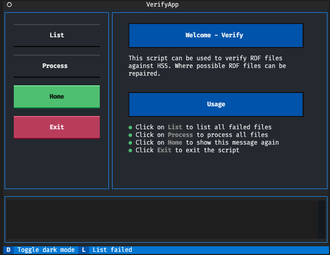

# Leistungsnachweis 2

## Abstract

Python script to verify RDF files against a Hypersuite HS5 Archive instance.
 

## Requirements
### Development Environment
- GIT
- Python >= 3.11.2 with pip
- Docker Desktop >=  4.16.2 to mock Hypersuite HS5 Database
- [pgAdmin 4](https://www.pgadmin.org/) installed

### Production Environment
- GIT
- Python >= 3.11.2 with pip
- Hypersuite HS5 >= 5.14, running with Oracle 21c

## Setup
### Development Environment

1. Clone repository:
    ```shell
    git clone https://github.com/abaumeler/CAS_DMIT.git
    ```
2. Install require Python packages with pip
   ```shell
   cd ln02
   pip install -r requirements.txt
   ```
3. Create `.env` file in the project root directory and add the required env variables:
   ```shell
   cd ln02
   touch .env
   ```

   file content:
   ```shell
   POSTGRES_USER=<choose user>
   POSTGRES_PASSWORD=<choose pw>
   POSTGRES_DB=HS5
   ```
4. Start Database with docker-compose. This will pull the lates postgres image and create a datbase on `localhost:5432`:
    ```shell
    cd docker
    docker-compose up -d
    ```
5. Start pgAdmin and connect to `localhost:5432` with the credentials specified in the `.env` file
6. Create the development Database and add some test data by running the following scripts from the `database/` directory:
    ```shell
    create_hest_client.sql
    create_hest_account.sql
    create_hest_person.sql
    create_hest_relation.sql
    create_edst_clientdoc.sql
    insert.sql
    ```
7. Verify that the setup is correct by running the `db_connect.py` script. This script prints the database version and the metadata for one document if everything has been setup correctly.
    ```shell
    python db_connect.py
    ```

    The script should output something like this:
    ```
    PostgreSQL database version:
    [('PostgreSQL 15.2 (Debian 15.2-1.pgdg110+1) on aarch64-unknown-linux-gnu, compiled by gcc (Debian 10.2.1-6) 10.2.1 20210110, 64-bit',)]
    fetching metadata for document with ID 215103589:
    DOCUMENT_ID: 215103589, DOC_NR: 802925355, CLIENT_NR: 1441841, ACCOUNT_NR: 151144184100, CLASSIFICATION: 7740-C-KASSE
    ```
## Development
This script uses the [Textual](https://textual.textualize.io) Framework. Textual offers a variety of [DevTools](https://textual.textualize.io/guide/devtools/) that can be used during development.

To run the script in production mode:
- Install dependencies: `pip install -r requirements.txt`
- Run the script `python verify.py`

To run the script in development mode:
- Install dependencies: `pip install -r requirements.txt`
- Open two terminal emulators
- In the first run the textual console `textual console`
- In the second run the script in dev mode `textual run --dev verify.py`
## Usage
This script uses the file `start.md` to show information about the usage

## Disclaimer
Please note that "Hypersuite HS5" is proprietary software that has been developed and is sold exclusively by [IMTF](https://imtf.com/). This software is protected by intellectual property laws, including but not limited to copyright laws and international treaties. This disclaimer serves as a notice that [IMTF](https://imtf.com/) retains all rights related to the ownership and distribution of Hypersuite HS5, and any use of the software should be done in accordance with the terms and conditions of the relevant licensing agreements.

Please be advised that "Hypersuite HS5" is a registered trademark owned by [IMTF](https://imtf.com/). To clarify, the trademark "Hypersuite HS5" is only used in this project to refer to the proprietary software developed and sold by IMTF. 

Please note that the exact specifications of the database used by [IMTF](https://imtf.com/) are considered trade secrets and are therefore not publicly available. Any information or data related to the IMTF database is proprietary and confidential, and any unauthorized access, use, or dissemination of such information is strictly prohibited. This disclaimer serves as a notice that [IMTF](https://imtf.com/) reserves all rights related to the protection of its trade secrets and confidential information.

It is important to note that while this project may utilize a database structure that is similar to that used by Hypersuite HS5, it is not an exact replication of the Hypersuite HS5 database structure. The database used in this project has been independently developed and may differ in its specifications, design, and functionality from the Hypersuite HS5 database. Therefore, any comparisons or assessments made between this project's database and the Hypersuite HS5 database should be made with caution, as they may not be fully representative of the actual [IMTF](https://imtf.com/) database.

Please be aware that as with any software, the functionality and performance of the script may be subject to various factors, including but not limited to user configuration, system compatibility, and unforeseeable events or circumstances. While every effort is made to ensure that the script operates as intended and is regularly updated, no guarantees or warranties can be made as to the accuracy, reliability, or completeness of the software or its suitability for any particular purpose. Therefore, this disclaimer serves as a notice that any use of the script is done at the user's own risk, and the developers shall not be held liable for any direct or indirect damages or losses that may arise from the use of the software.